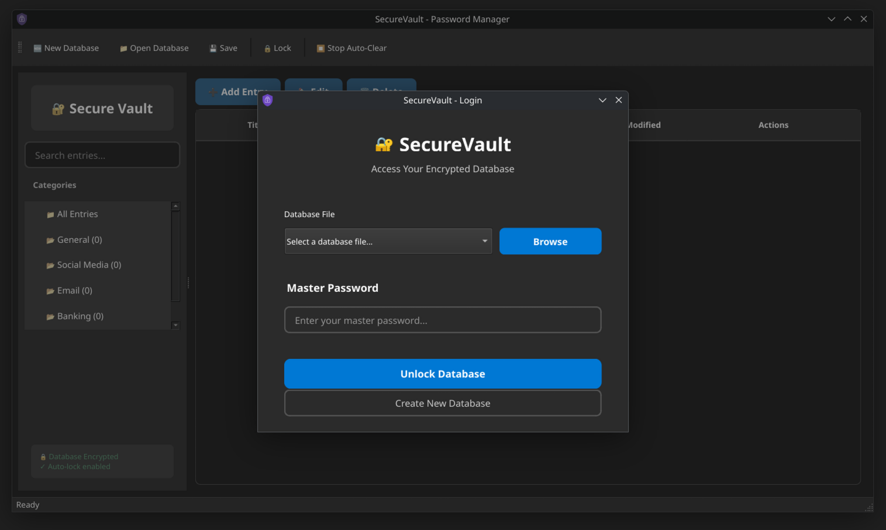

# SecureVault Password Manager


SecureVault is a modern, secure, and user-friendly password manager designed to protect your digital life. Built with Python and PySide6, it offers robust encryption, cross-platform compatibility, and an intuitive interface for managing all your credentials.

## Key Features

- 🔒 **Military-Grade Encryption**: AES-256 encryption with PBKDF2 key derivation
- 💾 **Auto-save Every 5 minutes**: Regular auto-saves provide backup protection
- 🌓 **Automatic Theme Switching**: Adapts to your system's light/dark theme
- 📋 **Clipboard Protection**: Auto-clears copied passwords after 30 seconds
- 🔑 **Password Generator**: Create strong, unique passwords with customizable rules
- 📁 **Portable Database**: Single encrypted file works across all your devices
- 🚫 **Zero-Knowledge Architecture**: Your master password never leaves your device
- 📊 **Category Organization**: Group credentials by type (Social, Banking, Work, etc.)
- 🔍 **Powerful Search**: Quickly find any credential by title, username, or URL

## 💖 Support

Scan to donate via Venmo:


## 📦 Installation

### 🪟 Windows
1. Download the latest installer from [Releases](https://github.com/bouness/securevault-password-manager/releases)
2. Run `SecureVaultInstaller.exe`
3. Follow the installation wizard

### 🐧 Linux
1. Download the latest `SecureVault-linux.tar.gz` from [Releases](https://github.com/bouness/securevault-password-manager/releases)

```bash
tar -xzf SecureVault-linux.tar.gz
cd SecureVault-v*

# to install
sudo ./installer/install.sh

# to remove
sudo ./installer/uninstall.sh
```

### Prerequisites
- Python 3.8+
- pip package manager

### Installation Steps
```bash
# Clone the repository
git clone https://github.com/bouness/securevault-password-manager.git
cd securevault-password-manager

# Install required dependencies
pip install -r requirements.txt

# Run the application
python main.py
```

## Usage Guide

### Getting Started
1. Launch SecureVault
2. Create a new database or open an existing file
3. Set a strong master password (minimum 8 characters)
4. Start adding your credentials

### Managing Passwords
- **Add Entry**: Click "+ Add Entry" to save new credentials
- **Edit/Delete**: Select an entry and use the toolbar buttons
- **Copy Credentials**: Use the action buttons in the table to copy usernames/passwords
- **Search**: Type in the search bar to filter entries
- **Categories**: Browse entries by category in the sidebar

### Database Management
- **Save**: Save changes with File > Save
- **Lock**: Lock your database with File > Lock
- **New**: Create a new database with File > New
- **Open**: Open existing database files (.svdb)

## Security Architecture

SecureVault implements multiple layers of security to protect your data:

1. **Master Password**: Your master password is never stored or transmitted
2. **Key Derivation**: PBKDF2-HMAC-SHA256 with 600,000 iterations
3. **Encryption**: AES-256 via Fernet with random per-database salt
4. **Clipboard Protection**: Automatically clears clipboard after 30 seconds
5. **Memory Protection**: Sensitive data is cleared from memory when locked

## Screenshots

| Login Screen | Main Password Vault |
|--------------|---------------------|
|  |  |

## Technical Details

### File Format
SecureVault uses a custom encrypted file format (.svdb) that contains:
- Encrypted JSON data
- Random salt (base64 encoded)
- Version information
- Creation timestamp

### Dependencies
- PySide6 (GUI framework)
- cryptography (encryption library)
- secrets (secure random generation)

### Database Structure
```javascript
{
  "version": "1.1",
  "created": "2025-08-15T12:34:56.789",
  "salt": "b64-encoded-random-salt",
  "categories": ["General", "Social", ...],
  "entries": [
    {
      "id": 0,
      "title": "Example Site",
      "username": "user@example.com",
      "password": "encrypted-data",
      "url": "https://example.com",
      "category": "General",
      "notes": "Additional information",
      "created": "2025-08-15T12:34:56.789",
      "modified": "2025-08-16T10:11:12.345"
    }
  ]
}
```

## Contributing

We welcome contributions! Here's how to get started:

1. Fork the repository
2. Create a new branch (`git checkout -b feature/your-feature`)
3. Commit your changes (`git commit -am 'Add some feature'`)
4. Push to the branch (`git push origin feature/your-feature`)
5. Open a pull request

### Areas for Contribution
- UI/UX improvements
- Additional encryption options
- Browser extension integration
- Mobile companion app
- Automated backups
- Password strength auditing

## License

SecureVault is released under the **MIT License**. See the [LICENSE](LICENSE) file for details.

## Disclaimer

SecureVault is provided "as is" without any warranties. The developers are not responsible for any data loss or security breaches. Always maintain backups of your password database.

---

**Protect your digital life with SecureVault - because your security shouldn't be an afterthought.**